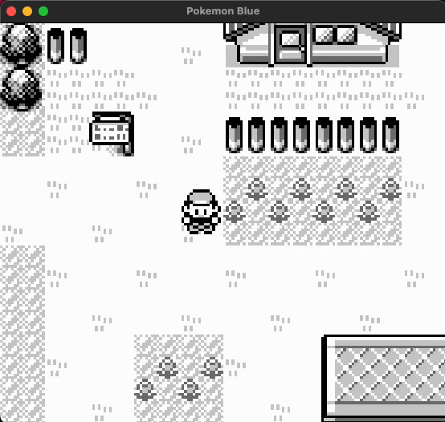

  

# Gameboy-Swift
GameBoy-Swift is a DMG Gameboy emulator for MacOS written in Swift.

# Minimum Requirements
- MacOS 10.15+
- Xcode 14+

# Installation
1. Download the project and open it in Xcode
2. Select the `Gameboy Swift - Release` scheme
3. Change the development team for the `Gameboy Swift` target to your own
4. Run the project

> Gameboy-Swift uses no third party dependencies.

## Supported Features
- Video
- Audio
- Battery Saves
- MBC0, MBC1, and MBC3
- Custom Settings (more below)

## Unsupported Features
- External gamepad Support
- MBC2, MBC4, MBC5, MBC6, MBC7 (and any other special MBCs)
- Save States
- Vin sound channel

## Controls
| Button | Key         |
|:------:|:-----------:|
| a      | Z           |
| b      | X           |
| Start  | Enter       |
| Select | Shift       |
| Up     | Up Arrow    |
| Down   | Down Arrow  |
| Left   | Left Arrow  |
| Right  | Right Arrow |

## Settings
Gameboy-Swift supports the following user-settings:
- Game speed multiplier from 0x to 8x speed
- Toggle for displaying the full 256x256 screen
- Individual toggles for hiding/showing sprites, tiles and windows
- Multiple colour palettes
  - Black and white
  - Game Boy DMG green
  -  Game Boy Pocket
- Custom ARGB sliders for each colour ID
- Individual toggles for each sound channel

## Accuracy
The emulator is decently accurate, however some of the finer details of the PPU and APU have not been implemented, resulting in some audio and visual bugs.

The emulator has also been tested against [Blargg's Test Roms](https://github.com/L-P/blargg-test-roms/).
The CPU instructions and instruction timing tests pass, however the rest fail in most of their individual test cases.

| Test            | Result |
|:---------------:|:------:|
| cgb_sound       | ❌     |
| cpu_instrs      | ✅     |
| dmg_sound       | ❌     |
| halt_bug        | ❌     |
| instr_timing    | ✅     |
| interrupt_time  | ❌     |
| mem_timing      | ❌     |
| mem_timing-2    | ❌     |
| oam_bug         | ❌     |

## References
A collection of references that helped me build this app:

[Pandocs (Markdown)](https://gbdev.io/pandocs/About.html)

[Pandocs](http://bgb.bircd.org/pandocs.htm)

[Interactive Opcode Table](https://meganesu.github.io/generate-gb-opcodes/)

[Codeslinger GameBoy Emulator Tutorial](http://www.codeslinger.co.uk/pages/projects/gameboy/lcd.html)

[Imrann Nazar GameBoy Emulator Tutorial](http://imrannazar.com/GameBoy-Emulation-in-JavaScript:-The-CPU)

[gbdoc](https://mgba-emu.github.io/gbdoc/)

[Cycle-Accurate GameBoy Docs](https://github.com/AntonioND/giibiiadvance/blob/master/docs/TCAGBD.pdf)

[Gekkio GameBoy: Complete Techinal Reference](https://gekkio.fi/files/gb-docs/gbctr.pdf)

[GameBoy CPU Manual](http://marc.rawer.de/Gameboy/Docs/GBCPUman.pdf)

[PPU Tests](https://github.com/mattcurrie/dmg-acid2)

https://blog.tigris.fr/2019/09/15/writing-an-emulator-the-first-pixel/

https://robertovaccari.com/blog/2020_09_26_gameboy/

https://mstojcevich.github.io/post/d-gb-emu-registers/

https://realboyemulator.wordpress.com/2013/01/03/a-look-at-the-game-boy-bootstrap-let-the-fun-begin/

https://www.copetti.org/writings/consoles/game-boy/

https://nightshade256.github.io/2021/03/27/gb-sound-emulation.html
